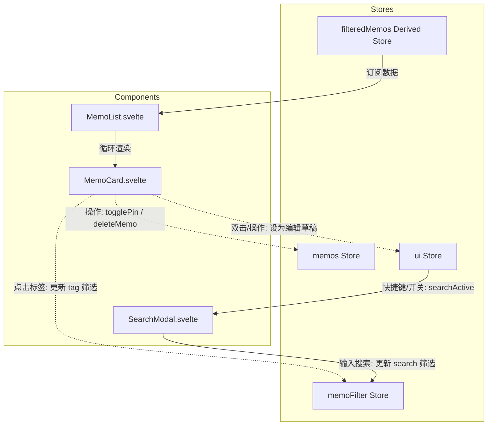

# MemoFlow 笔记列表与展示组件设计说明书

## 1. 背景与目标
在 MemoFlow 项目中，笔记的展示（Card）、列表流渲染（List）和全局搜索（Search Modal）是用户最核心的交互触点。为了在保持极简与现代视觉风格的前提下，提供丝滑、高性能、符合 Svelte 5 Runes 规范的体验，我们需要设计并编写以下三个组件：
1. `src/lib/components/MemoCard.svelte`：单条笔记卡片。
2. `src/lib/components/MemoList.svelte`：无限滚动笔记时间流。
3. `src/lib/components/SearchModal.svelte`：全局快捷搜索弹窗。

---

## 2. 状态关系与数据流

所有组件通过全局 Svelte Stores (`$lib/stores/memos` 和 `$lib/stores/ui`) 共享状态并触发行为。



---

## 3. 组件设计细节

### 3.1 `MemoCard.svelte` (单条笔记卡片)

#### 3.1.1 接口定义 (Svelte 5 `$props`)
```typescript
interface Props {
  memo: Memo;
  onedit?: (memo: Memo) => void;
}
```

#### 3.1.2 关键交互实现
1. **时间戳格式化**：
   - 将 `createdAt` (例如 `2026-07-06T02:03:34.000Z`) 转换为 `YYYY-MM-DD HH:mm:ss` 格式的本地时间。
2. **操作下拉菜单**：
   - 在卡片右上角放置一个“更多”按钮，点击时展开菜单。
   - 菜单包含：“编辑”（双击也是此行为）、“置顶 / 取消置顶” (联动 `memos.togglePin`)、“移至回收站” (联动 `memos.deleteMemo`)。
   - 下拉菜单使用局部状态管理 `let menuOpen = $state(false)`，点击外部时自动收起。
3. **正文 HTML 渲染与 Tiptap 兼容**：
   - 使用 Svelte 5 的 `{@html memo.content}` 渲染内容。
   - 用 CSS 选中 `.memo-content mark`（高亮）样式，为其赋予主色淡背景：`background-color: var(--color-primary-light); color: var(--color-primary-hover); padding: 0 4px; border-radius: var(--radius-sm);`。
   - 用 CSS 选中 `.memo-content a`（超链接），使其带有下划线和主色，并且通过 JavaScript 动态为所有 `<a>` 标签加上 `target="_blank" rel="noopener noreferrer"` 以防在当前页重定向。
4. **多级标签卡片**：
   - 利用 `tags` 数组（例如 `["读书笔记", "读书笔记/设计"]`）进行渲染。
   - 每一个标签都是可点击的小徽章。点击标签时触发 `memoFilter.update(f => ({ ...f, tag: clickedTag }))` 联动过滤。
5. **图片资源列表 (Lightbox 效果)**：
   - 从 `memo.resources` 中过滤出 `mimeType` 以 `image/` 开头的资源。
   - 展示缩略图网格（例如 1张大图，2-4张九宫格，使用 `object-fit: cover` 保持正方形比例）。
   - 点击任意缩略图时，设置局部状态 `let activePreviewUrl = $state<string | null>(null)`，渲染一个覆盖全屏的 Lightbox 模态框，带淡入淡出（fade）与缩放（scale）动画，点击遮罩或右上角关闭。
6. **双击卡片编辑**：
   - 监听 `.memo-card-body` 的 `ondblclick` 事件。
   - 触发时执行 `onedit?.(memo)`，同时联动更新全局编辑状态：
     ```typescript
     ui.setActiveMemoId(memo.id);
     ui.setMemoDraft(memo.content);
     ui.setEditModalOpen(true);
     ```

---

### 3.2 `MemoList.svelte` (笔记时间流)

#### 3.2.1 接口定义 (Svelte 5 `$props`)
```typescript
interface Props {
  // 无特殊必传参数，内部直接联动 stores
}
```

#### 3.2.2 关键交互实现
1. **无限滚动渲染**：
   - 内部维护前端分页数量：`let visibleCount = $state(15)`。
   - 导出派生属性展示列表：`let displayedMemos = $derived($filteredMemos.slice(0, visibleCount))`。
   - 在列表底部放置一个 `observerTarget` 哨兵 DOM。
   - 使用 `Intersection Observer` 监听该哨兵，一旦可见且 `visibleCount < $filteredMemos.length`，就执行 `visibleCount += 15`。
2. **加载最新与刷新提醒**：
   - 在列表最上方设计一个刷新提醒区域。
   - 当点击“加载最新”或通过下拉动作时，执行 `memos.fetchMemos()` 重新拉取后端数据，并带有 Loading 过渡动画。
   - 当 `filteredMemos` 数据为空时，展示空状态插图和提示文字。

---

### 3.3 `SearchModal.svelte` (全局搜索弹窗)

#### 3.3.1 接口定义 (Svelte 5 `$props`)
```typescript
interface Props {
  // 内部直接联动 ui 与 memoFilter store
}
```

#### 3.3.2 关键交互实现
1. **全局快捷键监听**：
   - 监听键盘 `keydown` 事件：
     - 若按下 `(ctrlKey || metaKey) && key === 'k'`：阻止默认行为，激活搜索弹窗 `ui.setSearch(true)`。
     - 若当前弹窗处于开启状态，且按下 `Escape`：关闭搜索弹窗 `ui.setSearch(false)`。
2. **弹窗布局与动画**：
   - 包含固定在顶部的搜索输入框、匹配结果列表、以及底部的快捷键提示面板（`Esc 退出`、`Enter 选择` 等）。
   - 使用遮罩层配合淡入淡出、卡片缩放动效，提供丝滑体验。
3. **模糊搜索与列表过滤**：
   - 搜索输入框聚焦并绑定 `let query = $state('')`。
   - 输入字数改变时，触发 `$effect` 联动更新 `memoFilter.update(f => ({ ...f, search: query }))`。
   - 中部结果列表订阅自 `filteredMemos`。
   - 双击匹配的笔记可以直接呼起编辑或选中查看。

---

## 4. 视觉与动效规范 (Vanilla CSS)

* **主色**：`--color-primary (#2BBE73)`。
* **圆角**：卡片使用 `--radius-lg (12px)`，小组件使用 `--radius-md (8px)`。
* **阴影**：卡片使用极浅阴影 `--shadow-sm`，弹窗使用高立体阴影 `--shadow-lg`。
* **动效**：
  - 下拉菜单展开：使用 `scale` 与 `opacity` 结合 `cubic-bezier(0.175, 0.885, 0.32, 1.275)`。
  - Lightbox 遮罩：`transition: opacity 0.2s ease`；大图：`transition: transform 0.3s cubic-bezier(0.1, 0.8, 0.25, 1)`。
  - 搜索弹窗弹出：`transform: scale(0.96) translateY(-20px)` 到 `scale(1) translateY(0)`。

---

## 5. 编写计划

1. 创建 `src/lib/components` 目录。
2. 编写 `MemoCard.svelte`（包括内部 Lightbox 实现、格式化、下拉菜单和 TiPtap HTML 支持）。
3. 编写 `MemoList.svelte`（实现时间流显示与 Intersection Observer 前端分页加载）。
4. 编写 `SearchModal.svelte`（实现全局 Ctrl+K 触发及结果过滤展示）。
5. 在 `src/routes/+page.svelte` 引入这三个组件进行集成测试。
